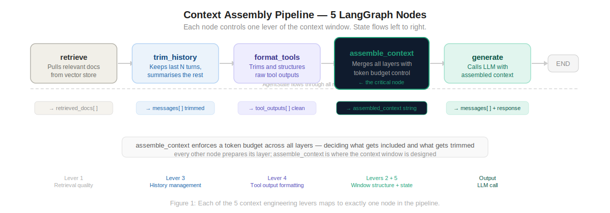
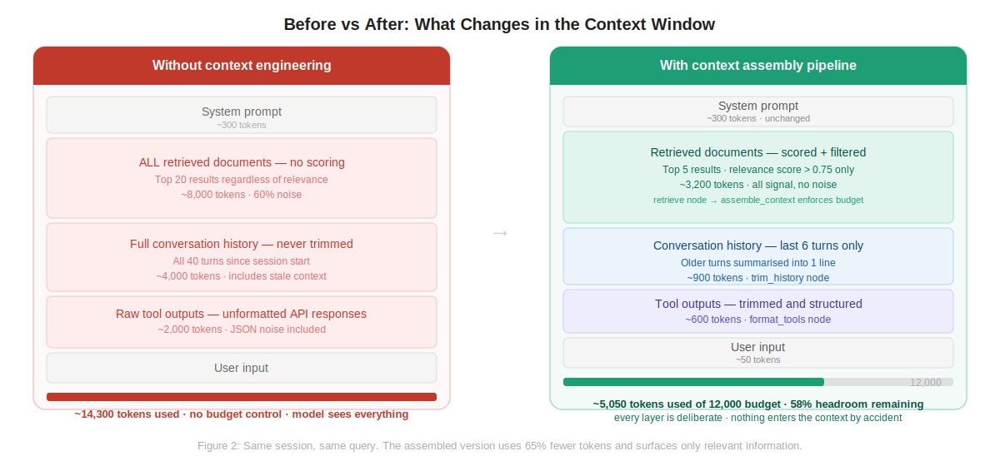

# langgraph-context-pipeline

A 5-node LangGraph pipeline that implements **context engineering** — designing what enters the model's context window rather than just tweaking the prompt.

Each node controls one lever of the context window. Nothing reaches the LLM without passing through all five.



> **Read the full breakdown:** [Building a Context Assembly Pipeline in LangGraph: The Part Tutorials Leave Out](https://medium.com/@anirudh)  
> **Companion concept article:** [Prompt Engineering Is Slowly Dying. Context Engineering Is What's Next.](https://medium.com/@anirudh)

---

## The Problem This Solves

Most agent tutorials assemble context the same way: dump everything into the prompt. Full history, all retrieved documents, raw tool outputs. This works in demos. In production it causes token budget blowouts, irrelevant content diluting signal, and stale context poisoning decisions.



This pipeline gives you deliberate control over every layer.

---

## Architecture

| Node | Controls | Lever |
|---|---|---|
| `retrieve` | Which documents enter the context | Retrieval quality |
| `trim_history` | How much conversation history is kept | History management |
| `format_tools` | How tool outputs are structured | Tool output formatting |
| `assemble_context` | Final context window composition + token budget | Window structure + state passing |
| `generate` | LLM call with assembled context | — |

---

## Quick Start

```bash
# 1. Clone and install
git clone https://github.com/yourusername/langgraph-context-pipeline.git
cd langgraph-context-pipeline
pip install -r requirements.txt

# 2. Set environment variables
cp .env.example .env
# Edit .env — add your OPENAI_API_KEY and MONGODB_URI

# 3. Run the demo
python notebooks/demo.py
```

---

## Usage

```python
from src.pipeline import run

result = run(query="What is our policy on third-party data processors?")

print(result["messages"][-1].content)
# Based on the company policy documents...

print(result["token_counts"]["assembled_total"])
# 4,820
```

**With conversation history:**

```python
from langchain_core.messages import HumanMessage, AIMessage
from src.pipeline import run

prior_messages = [
    HumanMessage(content="What does GDPR Article 28 require?"),
    AIMessage(content="Article 28 requires a Data Processing Agreement..."),
]

result = run(
    query="Does that apply to our cloud storage vendors?",
    messages=prior_messages,
)
```

**With tool outputs:**

```python
result = run(
    query="Summarise the latest compliance report.",
    tool_outputs=[
        {
            "tool_name": "fetch_document",
            "content": "Q3 Compliance Report: ... [full content]",
        }
    ],
)
```

---

## Configuration

All configuration is via environment variables. Copy `.env.example` to `.env`.

| Variable | Default | Description |
|---|---|---|
| `OPENAI_API_KEY` | — | Required |
| `MONGODB_URI` | — | Required |
| `MONGODB_NAMESPACE` | `mydb.documents` | Database.collection |
| `LLM_MODEL` | `gpt-4o` | Generation model |
| `LLM_TEMPERATURE` | `0` | Sampling temperature |
| `SUMMARY_MODEL` | `gpt-4o-mini` | Used for history summarisation |
| `TOKEN_BUDGET` | `10000` | Total context window budget |
| `MAX_HISTORY_TURNS` | `6` | Turns kept before summarising older ones |
| `MAX_TOOL_OUTPUT_CHARS` | `900` | Characters per tool output before truncation |
| `RETRIEVAL_THRESHOLD` | `0.75` | Minimum relevance score for retrieved docs |
| `RETRIEVAL_TOP_K` | `8` | Candidates retrieved before score filtering |
| `SYSTEM_PROMPT` | See default | Override the system prompt |

---

## Project Structure

```
langgraph-context-pipeline/
├── src/
│   ├── state.py              ← AgentState TypedDict
│   ├── utils.py              ← Token counting (tiktoken)
│   ├── pipeline.py           ← Graph assembly + run()
│   └── nodes/
│       ├── retrieve.py       ← Lever 1: retrieval quality
│       ├── trim_history.py   ← Lever 3: history management
│       ├── format_tools.py   ← Lever 4: tool output formatting
│       ├── assemble_context.py  ← Levers 2 + 5: window structure + state
│       └── generate.py       ← LLM call
├── notebooks/
│   └── demo.py               ← End-to-end walkthrough
├── diagrams/
│   ├── langgraph-context-pipeline-diagram-1.svg
│   └── langgraph-context-pipeline-diagram-2.svg
├── .env.example
├── .gitignore
├── requirements.txt
└── README.md
```

---

## Extending the Pipeline

**Swap the vector store:**  
Replace `MongoDBAtlasVectorSearch` in `src/nodes/retrieve.py` with any LangChain vector store — Pinecone, Weaviate, FAISS, etc. The node interface stays the same.

**Add conditional routing:**  
```python
def should_retrieve(state: AgentState) -> str:
    """Skip retrieval if the query is conversational."""
    if len(state["query"].split()) < 5:
        return "trim_history"
    return "retrieve"

graph.add_conditional_edges("retrieve", should_retrieve)
```

**Add evaluation:**  
Log `assembled_context` and `messages[-1].content` after every generation call. This is the dataset you need to catch retrieval failures systematically.

**Add streaming:**  
Replace `llm.invoke` with `llm.astream` in `generate_node` and wire to a Kafka topic for real-time applications.

---

## Common Issues

| Error | Cause | Fix |
|---|---|---|
| `retrieved_docs` is empty | Score threshold too high | Lower `RETRIEVAL_THRESHOLD` to 0.60 |
| Context window still oversized | Token estimates off | Already using tiktoken — check `TOKEN_BUDGET` value |
| History summary loses detail | Cheap model truncating | Increase `MAX_HISTORY_TURNS` before summary triggers |
| Tool output cuts mid-sentence | Character limit at non-boundary | Already handled with `rfind(" ")` — check `MAX_TOOL_OUTPUT_CHARS` |

---

## What's Next

This pipeline is the foundation. The series continues:

- [ ] Adding LLM-as-judge evaluation to measure whether context assembly is working
- [ ] Wiring the pipeline to Kafka for real-time streaming context
- [ ] Adding a human-in-the-loop approval node for enterprise deployments

---

## Related Articles

- [Prompt Engineering Is Slowly Dying. Context Engineering Is What's Next.](https://medium.com/@anirudh) — the conceptual foundation
- [Why AI Agents Fail in Production](https://medium.com/@anirudh)
- [Building AI Agents with LangGraph](https://medium.com/@anirudh)

---

## License
## Free to Use — With Eyes Open
## Copyright (c) 2026 Anirudh Yadav
You are free to use, copy, adapt, remix, and build on anything in this repository — for personal projects, your own whitepapers, your team's workflows, or anything else you can think of. No permission needed. No strings attached. If something here helps you, great. If you improve on it, even better — sharing back is appreciated but never required.

## The Part You Should Actually Read
This repository — the playbook, the code, the scripts, the examples, the diagrams, the PDF, the Word documents — is provided as-is, based on what worked for one person in one context. If you run a script and something breaks, that's on you to debug. In plain terms: use good judgment, test before you publish, verify before you cite, and don't hold this repo responsible for outcomes in your project. I will be happy to hear feedback, fix genuine errors, and improve the material — but accepts no liability for how it is used.

## Happy Coding.
## Feedback and corrections are welcome
